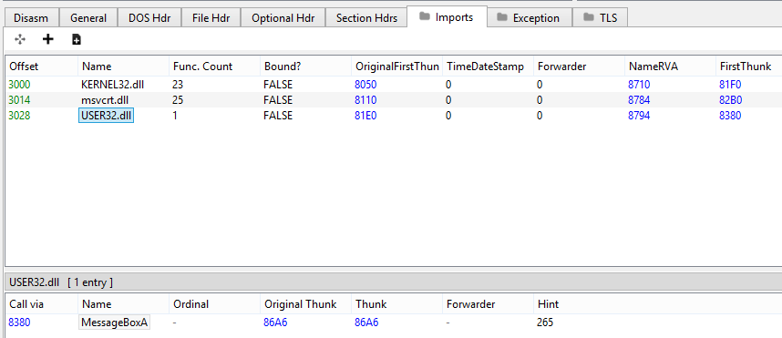

# Written by [hypervis0r](https://twitter.com/hypervis0r) and [Jeff](https://twitter.com/Jeffsepticeye2)


# Introduction

It was a cold winter morning. hypervis0r had just woken up at 1 AM because his sleep schedule was royally fucked, and he hopped onto the private phasetw0 discord server. In there, he noticed Jeff and base64 discussing the feasibility of running a binary search on the export data directory of a PE file in order to resolve functions.

hypervis0r, who is in love with hash tables, suggested an obvious solution for optimizing `GetProcAddress`; generating a hash table from a loaded DLL and using the hash table for constant-time lookup speeds. Base64, who feels the compulsive need to disagree with everything hypervis0r says, suggested that brute force lookup would probably be faster, and compelled him to run a benchmark. hypervis0r never turns down a challenge, so he decided to spend the next 8 hours of his life running tests.

Eight hours later, both hypervis0r and Jeff had programmed some basic implementations of `GetProcAddress` and battled them to the death with benchmarks. Spoiler alert, hypervis0r's implementation was the fastest (it always is), and he felt the need to compile this all into a blog post for the masses.

This article is not gonna cover anything in depth, since it was meant to just show the benchmarks of some methods Jeff and hypervis0r implemented. It's only going to briefly cover the concepts needed to understand the content of this article, along with providing links to some in-depth resources.

# How does GetProcAddress work?

For the uninitiated, all executable files on Windows contain an array of imported and exported functions stored inside the Portable Executable (PE) file format.

```c
#include <stdio.h>

int main(void)
{
	puts("ma name jeff");
	return 0;
}
```

If you are a C/C++ developer, you now that `puts` is not a function that you write yourself, but rather one you can magically call. This is possible through the use of [Dynamic-Link Libraries, or DLLs](https://en.wikipedia.org/wiki/Dynamic-link_library).

There are many DLLs, in this case `msvcrt.dll`, which have certain functions already compiled and exported (e.g. can be used by other programs). In this example, when your executable is loaded by Windows, the kernel will load `msvcrt.dll` into the address space of your new process, and the Import Address Table (IAT) of your executable will be updated with the virtual address of the exported function, in this case puts.

Take the following code, for instance.

```c
#include <windows.h>

int main(void)
{
	MessageBoxA(NULL, "calling MessageBoxA directly", "kek", MB_OK);
	return 0;
}
```

If you compile this code and open the executable in PE-bear (or any other PE file explorer), you will notice `MessageBoxA` among the imports of this program. If you were to open up the containing module in a PE file explorer, you would find `MessageBoxA` located in the list of exported functions.

# TODO : add title to this pic!!
 

This works because the Windows executable loader can read the IAT of the loaded executable, load `user32.dll` into the process address space, and update the virtual address for the import entry. When `MessageBoxA` gets called, the instruction pointer will get set to the updated virtual address in the IAT.

In addition to loadtime function resolving, functions can also be resolved dynamically during runtime. Take the following code, for example.

```c
#include <windows.h>

typedef int(WINAPI *_MessageBoxA)(HWND, LPCSTR, LPCSTR, UINT);

int main(void)
{
	HMODULE hUser32 = LoadLibrary("User32.dll");
	_MessageBoxA MyMessageBoxA = (_MessageBoxA)GetProcAddress(hUser32, "MessageBoxA");
	if (!MyMessageBoxA)
    {
		return -1;
	}

	MyMessageBoxA(NULL, "calling MessageBoxA undirectly", "kek", MB_OK);

	return 0;
}
```

This code does the exact same thing as the previous example. However, if you compile and examine the executable with a PE file explorer, you will find that there is no reference to `MessageBoxA` or `User32.dll` in the IAT.

# TODO : add title to this pic!!


This is standard behavior, as the program is not directly calling any functions from that DLL. As a result, there is no reason for it to be loaded by the Windows executable loader at loadtime. In this case, the program is manually loading `User32.dll` at runtime using `LoadLibrary`, finding the address of the function it needs using `GetProcAddress`, then calling it via a function pointer.

In essence, `GetProcAddress` walks through a table found in DLLs known as the export directory table to find the relative virtual address (RVA; relative to the DLL base address) of a function. This table contains the names and RVAs of every exported function in a PE file, and is used to resolve exported function locations easily. For more in-depth information, refer to [the MSDN page on the PE format](https://learn.microsoft.com/en-us/windows/win32/debug/pe-format#the-edata-section-image-only).

Using dynamic function resolution has the advantage of removing what functions you're intending to call from the IAT. For example, let's take a basic shellcode injection. The usual implementation of it follows the pattern `OpenProcess -> VirtualAllocEx -> WriteProcessMemory -> CreateRemoteThread -> WaitForSingleObject`, so whenever you see these functions in the IAT, you can be reasonably sure that there is some kind of injection happening. By dynamically resolving functions at runtime, you can remove those patterns from your executable import table.

There is one key thing to note however; if you take another look at the above picture, you'll find that the executable now has two additional imports from `kernel32.dll`, `LoadLibraryA` and `GetProcAddress`. You wouldn't know what functions are being called, however if you were experienced in reverse-engineering, you would know that dynamic function analysis is being used somehow. Knowing this, one could simply disassemble the function where `GetProcAddress` was called to find the resolved function.

For pretty obvious reasons, we didn't want `GetProcAddress` to appear in our imports, nor to get hooked somehow. The relatively simple solution was to make an implementation which manually parses the loaded DLLs to get the address of the function you want, without calling any external Windows API function. As it turns out, with a bit of knowledge about the [PE file format](https://blog.kowalczyk.info/articles/pefileformat.html) you can easily do it; however after reviewing several code repositories on GitHub, we noticed that a lot of them had a similar implementation, which is an (almost) identical inline assembly block (it's almost like they're are copy-pasting it or something!)

Simply rewriting `GetProcAddress` is no fun, we are computer scientists after all. To recount the introduction, hypervis0r and Jeff were curious to see if the `GetProcAddress` implementation could be potentially optimized for maximum speed and efficiency. As a result, we drew up a few different implementations and benchmarked each to determine if `GetProcAddress` could be faster in any such way.

To run our benchmarks, we decided to use [Google's benchmark library](https://github.com/google/benchmark), written in C++. This library takes accurate measurements down to the nanosecond, and runs thousands of iterations to ensure a stable result. Along with benchmark, we decided to test against ntdll.dll, as it contains thousands of exports with different names.

```c
/*
	Exported function names located in different
	positions in the export directory.
*/
std::array<const char*, 21> func_names = {
   "A_SHAFinal",
   "CsrAllocateCaptureBuffer",
   "DbgBreakPoint",
   "EtwProcessPrivateLoggerRequest",
   "KiRaiseUserExceptionDispatcher",
   "LdrAccessResource",
   "MD4Final",
   "_wcsnset_s",
   "abs",
   "bsearch",
   "ceil",
   "fabs",
   "iswctype",
   "labs",
   "mbstowcs",
   "pow",
   "qsort",
   "sin",
   "tan",
   "vDbgPrintEx",
   "wcscat" };
```

# Case 1: Stock GetProcAddress
### Written by hypervis0r
